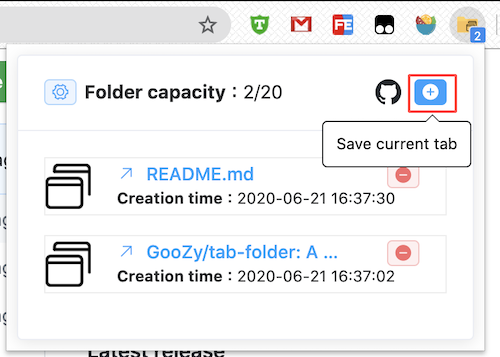
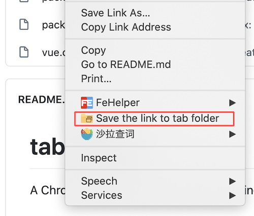
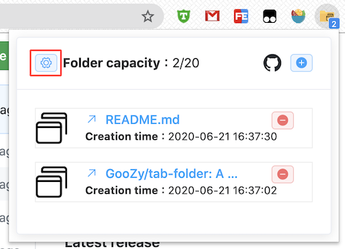

# tab-folder

A Chrome extension for temporarily saving tabs you want to open later.

## Introduce

### Add tab

There are three ways you can add a tab to the folder.

#### 1. Press Ctrl(Win)/Command(Mac)+K

#### 2. Click the add button.


#### 3. Right click on the page or link.


### Settings

For now, you only can change the capacity of the folder on setting page.



## Project setup
```
npm install
```

### Compiles and hot-reloads for development
```
npm run build-watch
```

### Compiles and minifies for production
```
npm run build
```

## Copyright

### Icon


"multiple" icon made by <a href="https://icon54.com/" title="Pixel perfect">Pixel perfect</a> from <a href="https://www.flaticon.com/" title="Flaticon"> www.flaticon.com</a>


"folder" icon made by <a href="https://www.flaticon.com/authors/dinosoftlabs" title="DinosoftLabs">DinosoftLabs</a> from <a href="https://www.flaticon.com/" title="Flaticon">www.flaticon.com</a>
